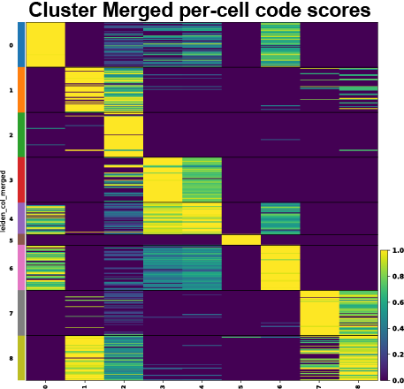
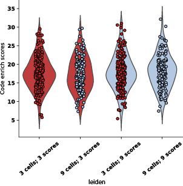

# Cytocipher - detection of significantly different cell populations in scRNA-seq


## For a complete tutorial that installs cytocipher & reproduces the pancreas development analysis, please see [here](https://github.com/BradBalderson/Cytocipher/tree/main/tutorials/cytocipher_pancreas.ipynb).

## Installation 
pip install coming soon, for this early release, 
just going with git clone, add to path, and pip install -r requirements.txt.

For example, in a jupyter notebook running python (I tested 3.8.12), the 
following should get everything up and running 

(***note that this installs the
source code to your current working directory***).

```
!git clone https://github.com/BradBalderson/Cytocipher.git
!pip install -r Cytocipher/requirements.txt
!pip install --no-deps scanpy==1.9.1
```
```
import sys
sys.path.append('Cytocipher')

import cytocipher as cc
```

## Expected Input
Given an AnnData object, *data*, that has been processed similarly to the 
[scanpy standard workflow](https://scanpy-tutorials.readthedocs.io/en/latest/pbmc3k.html)
to produce log-cpm normalised data with putative cluster labels 
(e.g. from Leiden clustering), then the following sections detail minimal code 
for cytocipher code scoring and cluster merging. 

## Code Scoring Minimal Example
Functions below run the marker gene identification, code scoring, & 
subsequent visualisation of the resulting cell by cluster enrichment scores. 

```
cc.tl.get_markers(data, 'leiden')
cc.tl.code_enrich(data, 'leiden')
cc.pl.enrich_heatmap(data, 'leiden')
```


In a jupyter notebook, you can see documentation using, for example:

```
?cc.tl.get_markers
```

## Cluster Merging Minimal Example
Below runs the cluster merging and visualises the heatmap of enrichment 
scores per cell for each of the new merged clsuters.

```
cc.tl.merge_clusters(data, 'leiden')
cc.pl.enrich_heatmap(data, 'leiden_merged')
```

To visualise the scores being compared for a given pair of clusters,
the following visualises the scores as violin plots of the enrichment scores
& prints the p-values determined by comparing the scores:

```
cc.pl.sig_cluster_diagnostics(data, 'leiden', plot_pair=('3', '9'))
```
<span style="color:grey">
Input pair ('3', '9')<br />
p=0.9132771265170103 (3 cells; 3 scores) vs (9 cells; 3 scores)<br />
p=0.8128313109661132 (3 cells; 9 scores) vs (9 cells; 9 scores)<br />
</span>



To get an sense of the upper- and lower- bounds for what is considered
a significant cluster, default parameters plot the violins illustrated above 
for the upper- and lower- bounds of
significant versus non-significant cluster pairs:

```
cc.pl.sig_cluster_diagnostics(data, 'leiden')
```

## Issues
Please feel free to post an issue if there is a problem, & I'll fix it, while 
appreciating the feedback!

